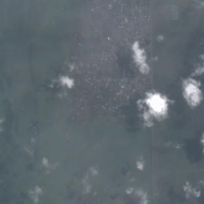
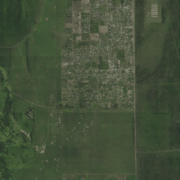
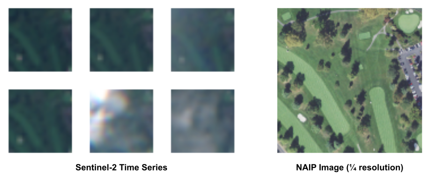
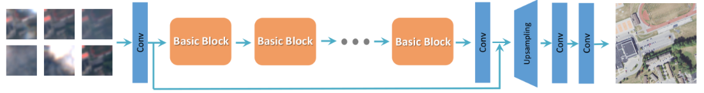
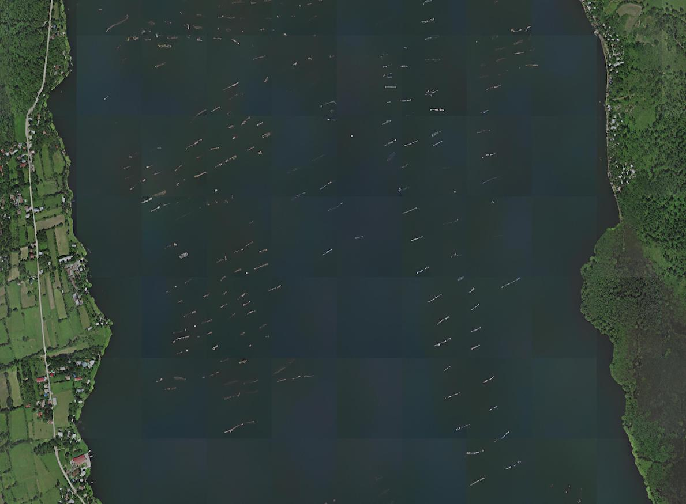
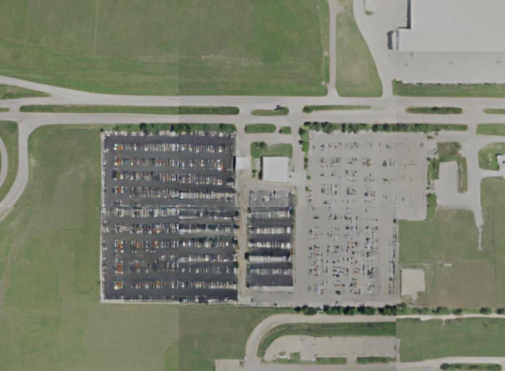
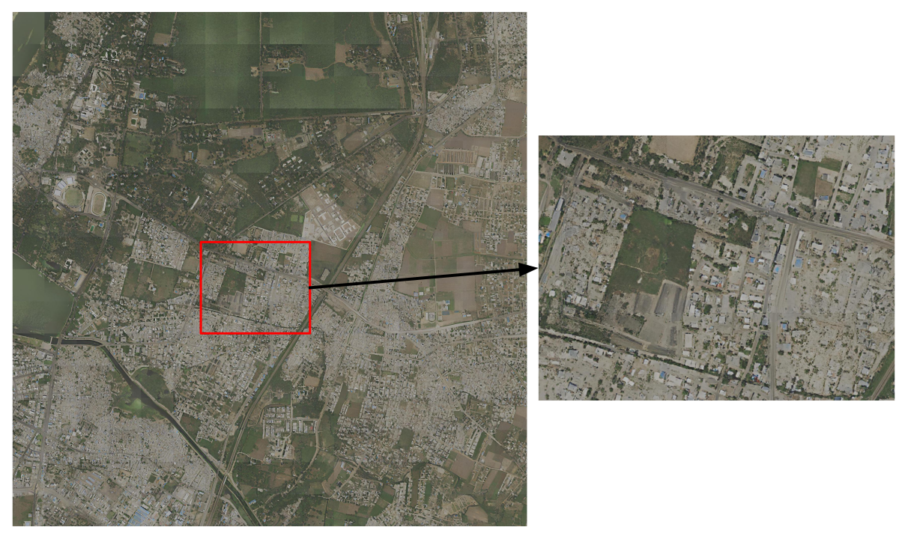

# Satlas Super Resolution

> [!NOTE] 
> This `experiments` branch will ultimately contain all config files needed to replicate results from the paper, including experiments
on the WorldStrat, OLI2MSI, PROBA-V, Sen2VENUS, and MuS2 datasets (along with our S2-NAIP dataset). 
> The `main` branch will be more stable, with less commits and only a handful of example config files.

[Satlas](https://satlas.allen.ai/) aims to provide open AI-generated geospatial data that is highly accurate, available globally, 
and updated on a frequent (monthly) basis. One of the data applications in Satlas is globally generated 
**Super-Resolution** imagery for 2023. 

   
   

We describe the many findings that led to the global super-resolution outputs in the paper, [Zooming Out on
Zooming In: Advancing Super-Resolution for Remote Sensing](https://arxiv.org/pdf/2311.18082.pdf). Supplementary material is available [here](https://pub-25c498004d1e4d4c8da69b2c05676836.r2.dev/Zooming_Out_On_Zooming_In_Supplementary.pdf). 

   

This repository contains the training and inference code for the AI-generated Super-Resolution data found at 
https://satlas.allen.ai/, as well as code, data, and model weights corresponding to the paper.

## Download

### Data
There are two training sets: 
- The urban set (train_urban_set), with ~1.1 million pairs from locations within a 5km radius of cities in the USA with a 
population >= 50k. There are 12 Sentinel-2 bands included in this set. Download links: [part1](https://pub-25c498004d1e4d4c8da69b2c05676836.r2.dev/train_urban_set.7z.001) [part2](https://pub-25c498004d1e4d4c8da69b2c05676836.r2.dev/train_urban_set.7z.002) [part3](https://pub-25c498004d1e4d4c8da69b2c05676836.r2.dev/train_urban_set.7z.003) [part4](https://pub-25c498004d1e4d4c8da69b2c05676836.r2.dev/train_urban_set.7z.004)
- The full set (train_full_set), consisting of ~44million pairs from all locations where NAIP imagery was available between 2019-2020. The full set, in the data format established prior
 to 2023-12-08, can be downloaded at this [link](https://pub-956f3eb0f5974f37b9228e0a62f449bf.r2.dev/satlas_explorer_datasets/super_resolution_train-full-set_2023-12-01.tar).

The urban set (termed S2-NAIP) was used for all experiments in the paper, because we found the full set to be overwhelmed with monotonous landscapes. 

There are three val/test sets:
- The validation set (val_set) consists of 8192 image pairs. There are 12 Sentinel-2 bands included in this set. ([download](https://pub-25c498004d1e4d4c8da69b2c05676836.r2.dev/super_resolution_val_set_2024-01-09.tar))
- A small subset of this validation set (small_val_set) with 256 image pairs that are specifically from
urban areas, which is useful for qualititive analysis and faster validation. ([download](https://pub-25c498004d1e4d4c8da69b2c05676836.r2.dev/super_resolution_small_val_set_2024-01-09.tar))
- A test set (test_set) containing eight 16x16 grids of Sentinel-2 tiles from interesting locations including
Dry Tortugas National Park, Bolivia, France, South Africa, and Japan. ([download](https://pub-25c498004d1e4d4c8da69b2c05676836.r2.dev/super_resolution_test_set_2024-01-09.tar))

Additional data includes:
- A set of NAIP images from 2016-2018 corresponding to the train_urban_set and small_val_set NAIP images (old-naip). These are used as input to the discriminator for the model variant described in supplementary Section A.5.2. ([download](https://pub-25c498004d1e4d4c8da69b2c05676836.r2.dev/old_naip.tar))
- JSON files containing tile weights for the train_urban_set and train_full_set (train_tile_weights). Using OpenStreetMap categories, we count the number of tiles where each category appears at least once and then weight tiles by the inverse frequency of the rarest category appearing in that tile. ([download](https://pub-25c498004d1e4d4c8da69b2c05676836.r2.dev/super_resolution_train_tile_weights.tar))
- For train_urban_set, there is a JSON file with mappings between each NAIP chip and polygons of OpenStreetMap categories in that chip (osm_chips_to_masks.json). This is used for the object-discriminator variation described in supplementary Section A.5.1. ([download](https://pub-25c498004d1e4d4c8da69b2c05676836.r2.dev/osm_chips_to_masks.json))
- RRDBNet weights from a model pretrained on SatlasPretrain. Used in experiment described in supplementary Section A.5.3. ([download](https://pub-25c498004d1e4d4c8da69b2c05676836.r2.dev/satlas_rrdbnet.pth))

All of the above data (except for the full training set due to size) can be downloaded at this [link](https://pub-956f3eb0f5974f37b9228e0a62f449bf.r2.dev/satlas_explorer_datasets/super_resolution_2023-12-08.tar), or individual links are provided above for ease of downloading.

The train_urban_set, split into many partitions, val_set, and test_set are available for [download on **HuggingFace**](https://huggingface.co/datasets/allenai/satlas-super-resolution/tree/main) as well.

### Model Weights
Weights from models trained on the S2-NAIP dataset are listed below.

#### ESRGAN
Varying number of input Sentinel-2 images (just RGB bands):
| Number Input Images | Weights | Config |
| ------------ | ------------ | ------------ |
| 1 | [1-S2-images](https://pub-25c498004d1e4d4c8da69b2c05676836.r2.dev/esrgan_1S2.pth) | [esrgan_baseline_1S2.yml](https://github.com/allenai/satlas-super-resolution/blob/experiments/ssr/options/experiments/esrgan_baseline_1S2.yml) |
| 2 | [2-S2-images](https://pub-25c498004d1e4d4c8da69b2c05676836.r2.dev/esrgan_2S2.pth) | [esrgan_baseline_2S2.yml](https://github.com/allenai/satlas-super-resolution/blob/experiments/ssr/options/experiments/esrgan_baseline_2S2.yml) |
| 4 | [4-S2-images](https://pub-25c498004d1e4d4c8da69b2c05676836.r2.dev/esrgan_4S2.pth) | [esrgan_baseline_4S2.yml]((https://github.com/allenai/satlas-super-resolution/blob/experiments/ssr/options/experiments/esrgan_baseline_4S2.yml) |
| 8 | [8-S2-images](https://pub-25c498004d1e4d4c8da69b2c05676836.r2.dev/esrgan_8S2.pth) | [esrgan_baseline.yml]((https://github.com/allenai/satlas-super-resolution/blob/experiments/ssr/options/experiments/esrgan_baseline.yml) |
| 16 | [16-S2-images](https://pub-25c498004d1e4d4c8da69b2c05676836.r2.dev/esrgan_16S2.pth) | [esrgan_baseline_16S2.yml]((https://github.com/allenai/satlas-super-resolution/blob/experiments/ssr/options/experiments/esrgan_baseline_16S2.yml) |

Different Sentinel-2 bands used as input (8 input images):
| Bands | Weights | Config |
| ------------ | ------------ | ------------ |
| 10m | [10m-S2-bands](https://pub-25c498004d1e4d4c8da69b2c05676836.r2.dev/esrgan_10m.pth) | [esrgan_baseline_10m.yml](https://github.com/allenai/satlas-super-resolution/blob/experiments/ssr/options/experiments/esrgan_baseline_10m.yml) |
| 20m | [20m-S2-bands](https://pub-25c498004d1e4d4c8da69b2c05676836.r2.dev/esrgan_20m.pth) | [esrgan_baseline_20m.yml](https://github.com/allenai/satlas-super-resolution/blob/experiments/ssr/options/experiments/esrgan_baseline_20m.yml) |
| 60m | [60m-S2-bands](https://pub-25c498004d1e4d4c8da69b2c05676836.r2.dev/esrgan_60m.pth) | [esrgan_baseline_60m.yml](https://github.com/allenai/satlas-super-resolution/blob/experiments/ssr/options/experiments/esrgan_baseline_60m.yml) |

#### SRCNN & HighResNet
- [SRCNN](https://pub-956f3eb0f5974f37b9228e0a62f449bf.r2.dev/satlas_explorer_datasets/super_resolution_models/srcnn_s2naip.pth)
- [HighResNet](https://pub-956f3eb0f5974f37b9228e0a62f449bf.r2.dev/satlas_explorer_datasets/super_resolution_models/highresnet_s2naip.pth)

## S2-NAIP Dataset Structure
The dataset consists of image pairs from Sentinel-2 and NAIP satellites, where a pair is a time series of Sentinel-2 images 
that overlap spatially and temporally [within 3 months] with a NAIP image. The imagery is from 2019-2020 and is limited to the USA.

   

The images adhere to the same Web-Mercator tile system as in [SatlasPretrain](https://github.com/allenai/satlas/blob/main/SatlasPretrain.md). 

### NAIP
The NAIP images included in this dataset are 25% of the original NAIP resolution. Each image is 128x128px with RGB channels.

In each set, there is a `naip` folder containing images in this format: `naip/{image_uuid}/{tile}/rgb.png`, where image_uuid is
the image's unique identifier with the capture timestamp, and tile refers to its location in a 2^17 x 2^17 Web-Mercator grid (ex. 12345_67890). 

### Sentinel-2
We use the Sentinel-2 L1C imagery. 
Models that input 3 bands use the TCI file provided by ESA. This contains an 8-bit image that has been normalized by ESA to the 0-255 range. 
The image is normalized for input to the model by dividing the 0-255 RGB values by 255, and retaining the RGB order.
Most experiments utilize just TCI, but for non-TCI bands, the 16-bit source data is divided by 8160 and clipped to 0-1.

For each NAIP image, there is a time series of corresponding 32x32px Sentinel-2 images. These time series are saved as pngs in the 
shape, `[number_sentinel2_images * 32, 32, 3]`. Note that the input images **do not** need to be in chronological order.

In each set, there is a `sentinel2` folder containing these time series in the format: `sentinel2/{tile}/{band}.png`, where 
tile refers to its location in a 2^17 x 2^17 Web-Mercator grid (ex. 12345_67890) and band refers to the Sentinel-2 bands 
(tci, b01, b05, b06, b07, b08, b09, b10, b11, b12).

## Model
In the paper, we experiment with SRCNN, HighResNet, SR3, and ESRGAN. For a good balance of output quality and inference speed, we 
use the ESRGAN model for generating global super-resolution outputs.

Our ESRGAN model is an adaptation of the original [ESRGAN](https://arxiv.org/abs/1809.00219), with changes that allow the input to be a time
series of Sentinel-2 images. All models are trained to upsample by a factor of 4. 

   

*The SR3 diffusion model code has lived in a separate repository. We are working to release that as well.*

## Training
To train a model on this dataset, run the following command, with the desired configuration file:

`python -m ssr.train -opt ssr/options/esrgan_s2naip_urban.yml` 

There are several sample configuration files in `ssr/options/`. Make sure the configuration file specifies 
correct paths to your downloaded data, the desired number of low-resolution input images, model parameters, 
and pretrained weights (if applicable).

Add the `--debug` flag to the above command if wandb logging, model saving, and visualization creation
is not wanted.

---------------------------------------- 
To train with multiple GPUs, use the following command:

`PYTHONPATH=. python -m torch.distributed.launch --nproc_per_node=8 --master_port=1234 ssr/train.py -opt ssr/options/esrgan_s2naip_urban.yml --launcher pytorch`

## Testing
To evaluate the model on a validation or test set, when **ground truth high-res images are available**,
run the following command, with the desired configuration file:

`python -m ssr.test -opt ssr/options/esrgan_s2naip_urban.yml`

This will test the model using data and parameters specified in `['datasets']['test']`, and will save the model 
outputs as pngs in the `results/` directory. Specified metrics will be displayed to the screen at the end. 

## Inference 
To run inference on data, when **ground truth high-res images are not available**, run the following command:

`python -m ssr.infer -opt ssr/options/infer_example.yml`

Inference settings are specified in the configuration file. The `data_dir` can be of any directory structure, but must contain pngs.
Both the original low-res images and the super-res images will be saved to the `save_path`.

---------------------------------------------------

When running inference on an entire Sentinel-2 tile (consisting of a 16x16 grid of chunks), there is the `infer_grid.py` script
that will stitch the individual chunks together into one large image. 

Try this out on the S2NAIP test set with this command:

`python -m ssr.infer_grid -opt ssr/options/infer_grid_example.yml`

   

## Accuracy
There are instances where the generated super resolution outputs are incorrect. 

Specifically: 

1) Sometimes the model generates vessels in the water or cars on a highway, but because the input is a time 
series of Sentinel-2 imagery (which can span a few months), it is unlikely that those things persist in one location.

   
   

2) Sometimes the model generates natural objects like trees or bushes where there should be a building, or vice versa.
This is more common in places that look vastly different from the USA, such as the example below in 
[Kota, India](https://www.google.com/maps/place/Kota,+Rajasthan,+India/@25.1726943,75.8520348). 

   

 

## Acknowledgements
Thanks to these codebases for foundational Super-Resolution code and inspiration:

[BasicSR](https://github.com/XPixelGroup/BasicSR/tree/master})

[Real-ESRGAN](https://github.com/xinntao/Real-ESRGAN/tree/master)

[Image Super-Resolution via Iterative Refinement (SR3)](https://github.com/Janspiry/Image-Super-Resolution-via-Iterative-Refinement)

[WorldStrat](https://github.com/worldstrat/worldstrat/tree/main)

## Contact
If you have any questions, please email `piperw@allenai.org` or [open an issue](https://github.com/allenai/satlas-super-resolution/issues/new).
